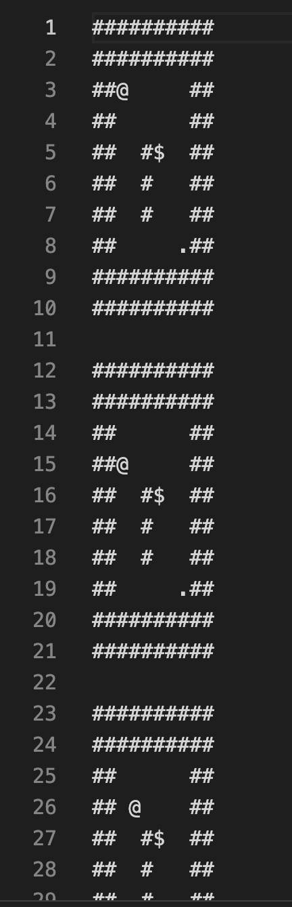

# Project Introduction

This project uses LLM to generate solution for sokoban puzzle game. It also use LangGraph to manage the workflow.

## Steps to Run

1. Ensure that your computer installs "uv" package.
2. At the project root path, type "uv sync"
3. At tye project root path, type "source .venv/bin/activate"
4. Set API_Key at [www.deepinfra.com](https://deepinfra.com/), and copy the key to `config.py`
5. Type "python3 main.py"

Waiting for the LLM generate solution for the chosen sokoban puzzle.
You could take a look at the running records at /result/running*record.csv
Each running step could be found in the file `/result/result_map*<data_file_name>.txt`.  
One example is:  

TODO:

1. Use Opik to manage/log LLM query
2. Use Javascript Game Engine Phaser to render the game UI.
